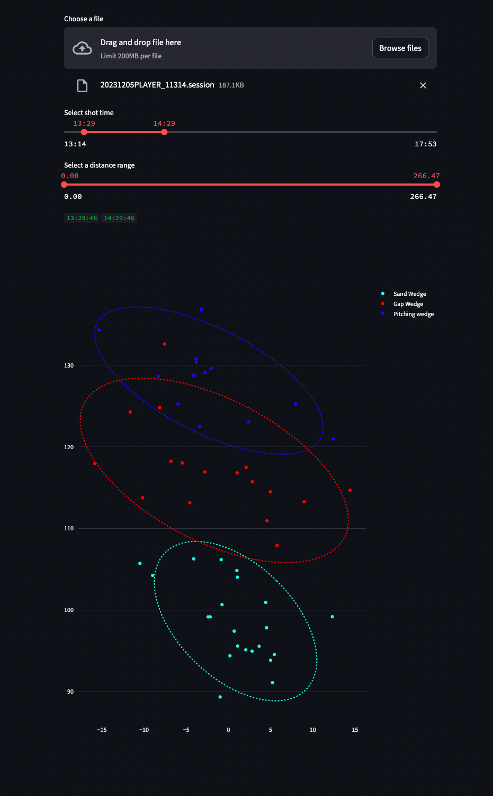

# FSX Shot Data Viewer
Upload a foresight golf simulator's shot data to view club specific shot data. Currently will show elipitical shot patterns per club.

## Usage
Deployed at [FSX Golf Shoft Viewer](https://fsx-golf-shot-viewer.streamlit.app/)



## Install

```sh
pip install -r requirements.txt
streamlit run app.py
```

## TODO 
- Give simple summary of distance + tolerance
- Modify shot list to remove outliers
- save shot list
- allow video upload to compare best and worst shots